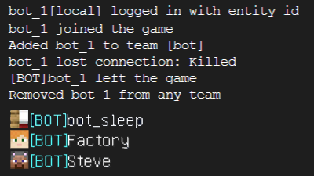

# AutoBOTPrefix
一个MCDReforged插件，能够自动为假人添加`[BOT]`前缀

## 功能

- 当假人(ip为"local")进入游戏时，自动为其添加`[BOT]`前缀

- 当假人退出游戏时，取消其`[BOT]`前缀

*建议搭配 https://github.com/tanhHeng/Here 的Here插件使用，以支持使用`!!vris`查询带`[BOT]`前缀的假人*

## 效果

控制台执行效果&显示

